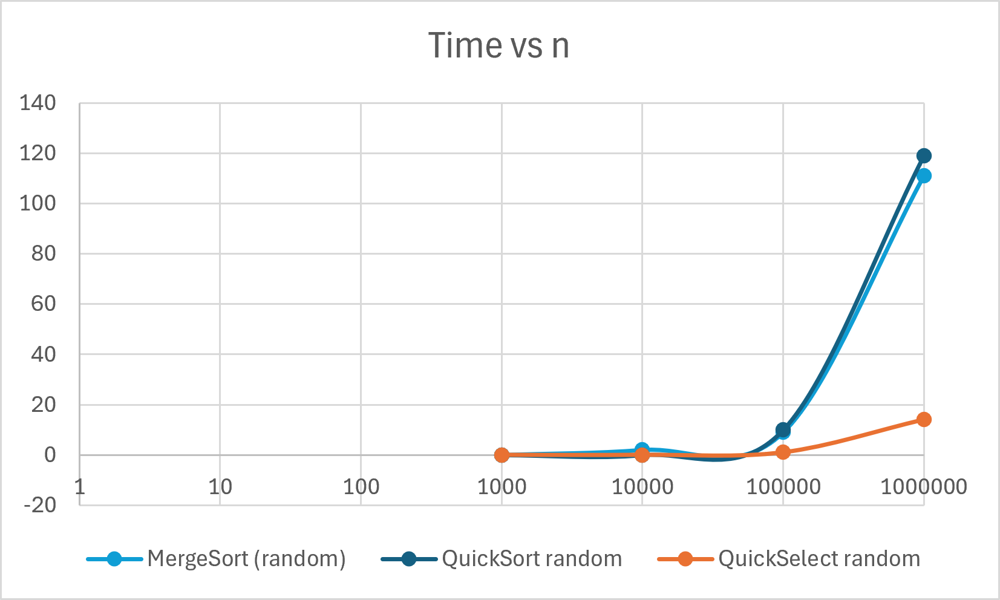
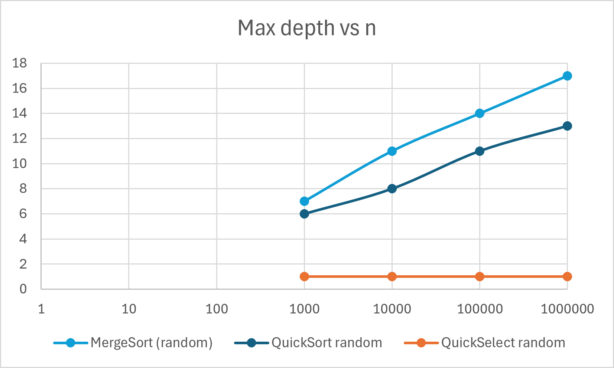
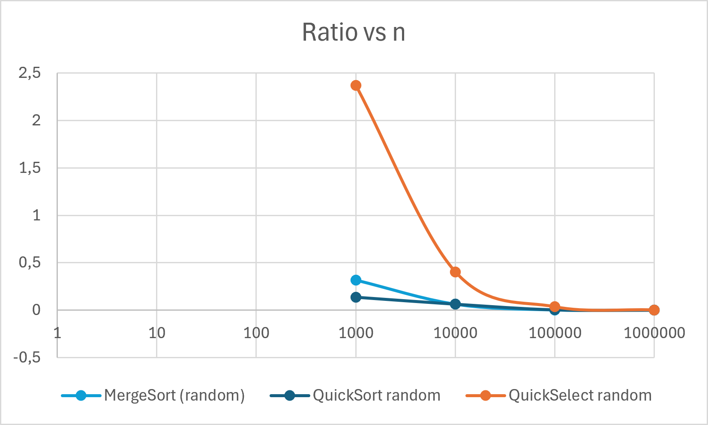

# Algorithm Analysis Assignment 1: Sorting & Selection Benchmarks

This repository contains implementation, empirical benchmarking, and theoretical analysis for **MergeSort**, **QuickSort**, and **QuickSelect** algorithms.

## Project Structure
- `src/` — Java implementation of sorting and selection algorithms.
- `results.csv` — Raw benchmark evaluation data.
- `time_vs_n.png` — Execution time comparison plot.
- `depth_vs_n.png` — Recursion depth evaluation plot.
- `ratio_vs_n.png` — Empirical ratio comparison plot.
- `REPORT.md` — Detailed theoretical and empirical analysis report.

## How to Run
1. Open the project in IntelliJ IDEA.
2. Run the main benchmark class: `src/Main.java` (or your benchmark runner class).
3. The benchmark will evaluate performance across different input sizes ($n = 1000, 10000, 100000, 1000000$) and generate/update results.

## Benchmark Visualizations

### Execution Time vs Input Size

### Recursion Depth vs Input Size

### Operation Ratio vs Input Size
